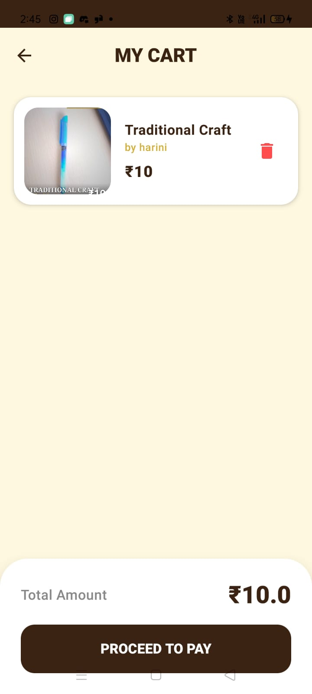

# Shilpa-Kala
### Android App Development using GenAI

## Project Description
Shilpa-Kala is an Android application developed using GenAI concepts to help artisans create professional product images using mobile phones. The app provides guided image capture, branding overlays, image enhancement, and product labeling features.

## Features
- Product Image Capture
- Guided Camera Overlay
- Branding and Logo Addition
- Product Detail Labels
- Save & Share Feature
- Multi-language Support (Kannada and English)

## Technologies Used
- Kotlin
- Android Studio
- CameraX
- Bitmap Image Processing
- Jetpack Compose
- GenAI Concepts

## Developed By
**Harini R**  
**USN:** 1CR22IS060

## Screenshots

### Welcome Page

### Login Page

### Home Page

### Photo Capture

### Adding Image

### Description Page

### Amount Processing

### Cart

### Added to Cart

### Cart Page

### Payment Page

### Portfolio Page

### Sharing on Social Media

